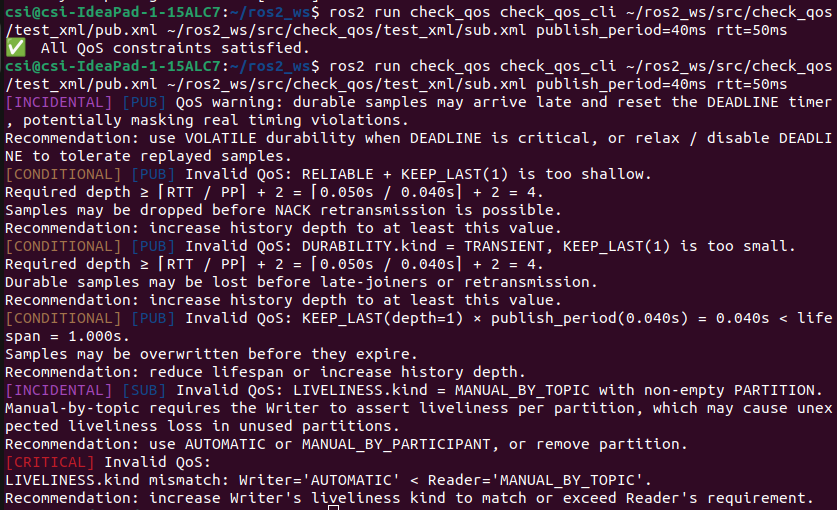

# Dependency Chain Analysis of ROS 2 DDS QoS Policies: From Lifecycle Tutorial to Static Verification
<p align="center">
  
  
</p>


## 📝 Paper Summary
ROS 2 is built on the Data Distribution Service (DDS) and leverages more than 20 Quality of Service (QoS) policies to control communication availability, reliability, and resource usage. However, in practice, users often lack clear guidance or pre-verification procedures for combining these policies, which frequently forces them into trial-and-error tuning or results in unexpected runtime failures.
To address this challenge, we decompose DDS publisher–subscriber communication into three phases—Discovery, Data Exchange, and Disassociation—and provide a tutorial-style explanation of how 16 key QoS policies operate at each stage. We also systematically analyze inter-policy dependencies, deriving a QoS Dependency Chain, and classify 40 common constraints into a set of Dependency-Violation Rules.
Building on this analysis, we developed the QoS Guard package, which enables offline verification of DDS XML profiles to detect potential conflicts before deployment. This allows users to safely configure QoS settings without needing to launch a ROS 2 session.
By offering both conceptual insights and a practical tool, this work helps ROS 2 users better understand and manage QoS policies, ultimately improving the reliability of robot communications and the efficiency of resource utilization.

## 💡 How to run it from the terminal

### Step-by-Step Guide

## 🔧 Install

```bash
# 1. Create a new ROS 2 workspace (if not created yet)
mkdir -p ~/ros2_ws/src
# 2. Move to the workspace source directory
cd ~/ros2_ws/src
# 3. Clone the QoS Guard repository
git clone --branch QosGuard_v3 https://github.com/QosGuard-Anonymous/qos-guard.github.io.git
# 4. Move back to workspace root and build the package
cd ~/ros2_ws
colcon build --packages-select check_qos
# 5. Source the environment
source install/setup.bash
```

## 🔧 How to Use

Once installed, run the QoS constraint checker using:
```bash
ros2 run check_qos check_qos_cli pub.xml sub.xml publish_period=40ms rtt=50ms
```
- `pub.xml`: Writer QoS profile
- `sub.xml`: Reader QoS profile
- `publish_period`: Writer's message interval(PP)
- `rtt`: Estimated round-trip time(RTT)

> ⚠️ Ensure XML files follow standard Fast DDS QoS profile format.

---

## 📂 Project Structure

```
check_qos/
├── check_qos/           
│   ├── __pycache__
│   ├── __init__.py
│   └── qos_checker.py    # Main rule logic
├── resource/           
│   └── check_qos
├── test/
│   ├── test_copyright.py
│   ├── test_flake8.py
│   └── test_pep257.py
├── test_xml/
│   ├── pub.xml           # Writer QoS profile
│   └── sub.xml           # Reader QoS profile
├── package.xml
├── setup.cfg
└── setup.py
```

---

## 🧪 What It Does

This tool parses QoS settings such as:

- `ENTITY_FACTORY`,`PARTITION`,`USER_DATA`,`GROUP_DATA`,`TOPIC_DATA`,`RELIABILITY`,`DURABILITY`, `DEADLINE`, `LIVELINESS`, `HISTORY`, `RESOURCE_LIMITS`, `LIFESPAN`, `OWNERSHIP(+STRENGTH)`, `DESTINATION_ORDER`, `WRITER_DATA_LIFECYCLE` and `READER_DATA_LIFECYCLE`

It checks both Writer and Reader profiles against **40+ rules** and reports:

- 🔴 **Critical** : likely to cause message loss or communication failure
- 🟠 **Conditional** : may cause runtime issues in specific situations
- 🟣 **Incidental** : recommended for better robustness

---


# QoS Guard Rule

Based on the following rules, each profile is automatically validated.

Here is some rules used in validation:

| ID No. | Identifier | QoS Conflict Condition | Entity Scope | Depenency Type | Validation Stage |
| --- | --- | --- | --- | --- | --- |
| 1 | HIST ↔RESLIM | [HIST.kind = KEEP_LAST] ∧ [HIST.depth > RESLIM.max_samples_per_instance] | — | Critical | 1 |
| 2 | RESLIM↔RESLIM | [RESLIM.max_samples < RESLIM.max_samples_per_instance] | — | Critical | 1 |
| 3 | HIST→DESTORD | [DESTORD.kind = BY_SOURCE_TIMESTAMP] ∧ [HIST.kind = KEEP_LAST] ∧ [HIST.depth = 1] | DataReader | Conditional | 1 |
| 4 | RESLIM→DESTORD | [DESTORD.kind = BY_SOURCE_TIMESTAMP] ∧ [HIST.kind = KEEP_ALL] ∧ [RESLIM.max_samples_per_instance = 1] | DataReader | Conditional | 1 |
| 5 | RDLIFE→DURABL | [DURABL.kind ≥ TRANSIENT] ∧ [RDLIFE.autopurge_disposed_samples_delay = 0] | DataReader | Incidental | 1 |
| 6 | ENTFAC→DURABL | [DURABL.kind = VOLATILE] ∧ [ENTFAC.autoenable_created_entities = FALSE] | — | Incidental | 1 |
| 7 | PART→DURABL | [DURABL.kind ≥ TRANSIENT_LOCAL] ∧ [PARTITION ≠ Ø] | — | Incidental | 1 |
| 8 | PART→DEADLN | [DEADLN.period > 0] ∧ [PARTITION ≠ Ø] | — | Incidental | 1 |
| 9 | PART→LIVENS | [LIVENS.kind = MANUAL_BY_TOPIC] ∧ [PARTITION ≠ Ø] | DataReader | Incidental | 1 |
| 10 | OWNST→WDLIFE | [WDLIFE.autodispose_unregistered_instances = TRUE] ∧ [OWNST.kind = EXCLUSIVE] | DataWriter | Incidental | 1 |
| 11 | HIST→DURABL | [DURABL.kind ≥ TRANSIENT_LOCAL] ∧ [HIST.kind = KEEP_LAST] ∧ [HIST.depth < ⌈RTT ⁄ PP⌉ + 2] | DataWriter | Conditional | 1 |
| 12 | RESLIM→DURABL | IF DURABILITY.kind ≥ TRANSIENT_LOCAL:IF HISTORY.kind == KEEP_ALL:RESLIM.max_sampel/instacne < ⌈RTT / PP⌉ + 2 | DataWriter | Conditional | 1 |
| 13 | LFSPAN→DURABL | [HISTORY.kind == KEEP_LAST] ∧ [LFSPAN.duration < RTT] | DataWriter | Conditional | 1 |
| 14 | HIST ↔LFSPAN | DURABL.kind ≥ TRANSIENT_LOCAL] ∧ [LIFESPAN.duration > HISTORY.depth * PP] | DataWriter | Conditional | 1 |
| 15 | RESLIM↔LFSPAN | [HIST.kind = KEEP_ALL] ∧ [LFSPAN.duration > RESLIM.max_samples_per_instance × PP] | DataWriter | Conditional | 1 |
| 16 | DEADLN→OWNST | [OWNST.kind = EXCLUSIVE] ∧ [DEADLN.period = ∞] | DataReader | Conditional | 1 |
| 17 | LIVENS→OWNST | [OWNST.kind = EXCLUSIVE] ∧ [LIVENS.lease_duration = ∞] | DataReader | Conditional | 1 |
| 18 | LIVENS→RDLIFE | [RDLIFE.autopurge_nowriter_samples_delay > 0] ∧ [LIVENS.lease_duration = ∞] | DataReader | Conditional | 1 |
| 19 | PART↔PART | [DataWriter.PARTITION ∩ DataReader.PARTITION = Ø] | — | Critical | 2 |
| 20 | RELIAB↔RELIAB | [DataWriter.RELIAB.kind < DataReader.RELIAB.kind] | — | Critical | 2 |
| 21 | DURABL↔DURABL | [DataWriter.DURABL.kind < DataReader.DURABL.kind] | — | Critical | 2 |
| 22 | DEADLN↔DEADLN | [DataWriter.DEADLN.period > DataReader.DEADLN.period] | — | Critical | 2 |
| 23 | LIVENS↔LIVENS | [DataWriter.LIVENS.kind < DataReader.LIVENS.kind] ∨ [DataWriter.LIVENS.lease_duration > DataReader.LIVENS.lease_duration] | — | Critical | 2 |
| 24 | OWNST ↔OWNST | [DataWriter.OWNST.kind ≠ DataReader.OWNST.kind] | — | Critical | 2 |
| 25 | DESTORD↔DESTORD | [DataWriter.DESTORD.kind < DataReader.DESTORD.kind] | — | Critical | 2 |
| 26 | WDLIFE→RDLIFE | [WDLIFE.autodispose_unregistered_instances = FALSE] ∧ [RDLIFE.autopurge_disposed_samples_delay > 0] | — | Conditional | 2 |
| 27 | RELIAB→DURABL | [DURABL.kind ≥ TRANSIENT_LOCAL] ∧ [RELIAB.kind = BEST_EFFORT] | — | Critical | 3 |
| 28 | HIST→RELIAB | [RELIAB.kind = RELIABLE] ∧ [HIST.kind = KEEP_LAST] ∧ [HIST.depth < ⌈RTT ⁄ PP⌉ + 2] | DataWriter | Conditional | 3 |
| 29 | RESLIM→RELIAB | [RELIAB.kind = RELIABLE] ∧ [HIST.kind = KEEP_ALL] ∧ [RESLIM.max_samples_per_instance < ⌈RTT ⁄ PP⌉ + 2] | DataWriter | Conditional | 3 |
| 30 | LFSPAN→RELIAB | [RELIAB.kind = RELIABLE] ∧ [LFSPAN.duration < RTT] | DataWriter | Conditional | 3 |
| 31 | RELIAB→OWNST | [OWNST.kind = EXCLUSIVE] ∧ [RELIAB.kind = BEST_EFFORT] | — | Conditional | 3 |
| 32 | RELIAB→DEADLN | [DEADLN.period > 0] ∧ [RELIAB.kind = BEST_EFFORT] | — | Conditional | 3 |
| 33 | LIVENS→DEADLN | [DEADLN.period > 0] ∧ [LIVENS.lease_duration < DEADLN.period] | DataReader | Conditional | 3 |
| 34 | RELIAB→LIVENS | [LIVENS.kind = MANUAL_BY_TOPIC] ∧ [RELIAB.kind = BEST_EFFORT] | — | Conditional | 3 |
| 35 | DEADLN→OWNST | [OWNST.kind = EXCLUSIVE] ∧ [DEADLN.period < 2 × PP] | DataReader | Conditional | 3 |
| 36 | LIVENS→OWNST | [OWNST.kind = EXCLUSIVE] ∧ [LIVENS.lease_duration < 2 × PP] | DataReader | Conditional | 3 |
| 37 | RELIAB→WDLIFE | [WDLIFE.autodispose_unregistered_instances = TRUE] ∧ [RELIAB.kind = BEST_EFFORT] | DataWriter | Conditional | 3 |
| 38 | HIST→DURABL | [DURABL.kind ≥ TRANSIENT_LOCAL] ∧ [HIST.kind = KEEP_LAST] ∧ [HIST.depth > ⌈RTT ⁄ PP⌉ + 2] | DataWriter | Incidental | 3 |
| 39 | RESLIM→DURABL | [DURABL.kind ≥ TRANSIENT_LOCAL] ∧ [HIST.kind = KEEP_ALL] ∧ [RESLIM.max_samples_per_instance > ⌈RTT ⁄ PP⌉ + 2] | DataWriter | Incidental | 3 |
| 40 | DURABL→DEADLN | [DEADLN.period > 0] ∧ [DURABL.kind ≥ TRANSIENT_LOCAL] | — | Incidental | 3 |
| 41 | LFSPAN→DEADLN | [LFSPAN.duration < DEADLN.period] | — | Critical | 1 |


---  

## 🖥️ Example Output

Below is an example of how the checker output looks in the terminal:


> 🔴 Red: Critical  🟠 Orange: Conditional  🟣 Purple: Incidental


## 📢 Notice
This project is currently compatible with ROS 2 Humble using Fast DDS 2.6.9.
Support for other DDS vendors such as Cyclone DDS and OpenDDS is planned in future updates.

### Contact & Collaboration
If you have any issues or questions about using this tool, please feel free to contact us anytime.

**Email**: [leesh2913@dgist.ac.kr](mailto:leesh2913@dgist.ac.kr)  
**Homepage**: [hun0130.github.io](https://hun0130.github.io/)

Research collaborations and industry-academia partnerships are also welcome!


